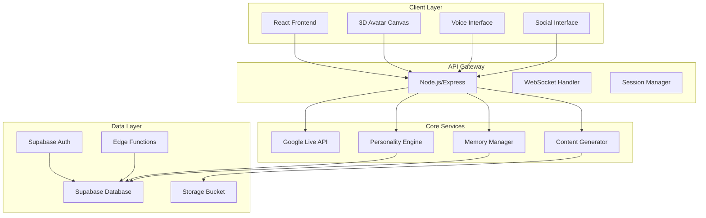

# Big Snuggles Voice AI Platform - Technical Architecture

## Executive Summary

Big Snuggles is a real-time voice-first AI entertainment platform featuring an immersive gangster teddy bear character with emotional intelligence, persistent memory, and social interaction capabilities. The system leverages Google's Gemini 2.5 Flash Live API for low-latency voice processing, React Three Fiber for 3D avatar rendering, and Supabase for persistent data management.

## System Overview

### Core Components
1. **Voice Processing Engine** - Google Gemini 2.5 Flash Live API integration
2. **3D Avatar System** - React Three Fiber-based character rendering
3. **Memory & Personality Engine** - Persistent context and adaptive behavior
4. **Social Layer** - Multi-user interactions and content sharing
5. **Analytics & Engagement** - Performance monitoring and user insights

## Architecture Diagrams

### High-Level System Architecture


### Voice Processing Pipeline

```mermaid
graph LR
    A[User Speech Input] --> B[16kHz PCM Conversion]
    B --> C[Voice Activity Detection]
    C --> D[Gemini Live API]
    D --> E[Real-time STT]
    E --> F[Personality Processing]
    F --> G[Affective Dialog]
    G --> H[Response Generation]
    H --> I[24kHz Audio Output]
    I --> J[Avatar Lip Sync]
    J --> K[User Playback]
```


## Detailed Component Architecture

### 1. Real-Time Voice I/O Pipeline

#### Google Gemini 2.5 Flash Live API Integration

**Model Configuration:**
- **Model**: `gemini-2.5-flash-native-audio-preview-09-2025`
- **Input Format**: 16-bit PCM, 16kHz mono (raw, little-endian)
- **Output Format**: 24kHz sample rate audio
- **Session Duration**: 15 minutes (audio-only sessions)
- **Context Window**: 128k tokens

**Key Features Implemented:**
- **Voice Activity Detection (VAD)**: Automatic detection of speech segments
- **Affective Dialog**: Emotion-aware response generation
- **Proactive Audio**: Intelligent response filtering
- **Thinking Capabilities**: Dynamic response processing
- **Bidirectional Streaming**: Real-time audio input/output

#### WebRTC Integration Strategy

```typescript
interface VoiceConfig {
  model: string;
  responseModalities: ['AUDIO'];
  speechConfig: {
    voiceConfig: {
      prebuiltVoiceConfig: {
        voiceName: string; // Custom gangster teddy voice
      }
    };
    languageCode: string;
  };
  enableAffectiveDialog: boolean;
  proactivity: {
    proactiveAudio: boolean;
  };
  thinkingConfig: {
    thinkingBudget: 1024;
    includeThoughts: boolean;
  };
  realtimeInputConfig: {
    automaticActivityDetection: {
      disabled: false;
      startOfSpeechSensitivity: StartSensitivity.START_SENSITIVITY_LOW;
      endOfSpeechSensitivity: EndSensitivity.END_SENSITIVITY_LOW;
      prefixPaddingMs: 20;
      silenceDurationMs: 100;
    };
  };
}
```

#### Audio Processing Pipeline

1. **Input Processing**:
   - Browser audio capture → 16kHz PCM conversion
   - Real-time audio chunking (100ms segments)
   - VAD-based activity detection
   - WebSocket streaming to backend

2. **API Integration**:
   - Node.js WebSocket client connecting to Gemini Live API
   - Session management with automatic reconnection
   - Ephemeral token authentication for security
   - Real-time audio streaming with backpressure handling

3. **Output Processing**:
   - 24kHz audio buffer processing
   - Lip-sync data extraction for avatar animation
   - WebSocket streaming to client
   - Browser audio playback with jitter buffer

### 2. Avatar Rendering Stack

#### React Three Fiber Architecture

**Core Components:**
- **AvatarEngine.tsx**: Main 3D scene controller
- **FacialExpressionSystem**: Real-time expression mapping
- **GestureLibrary**: Context-aware gesture animations
- **EmotionStateMapper**: Voice emotion → visual emotion conversion

**Technical Specifications:**
```typescript
interface AvatarConfig {
  modelPath: string;
  animationClips: {
    idle: string;
    talking: string;
    laughing: string;
    surprised: string;
    angry: string;
    gangster_gestures: string[];
  };
  facialRig: {
    jawOpen: string;
    lipSync: string;
    eyeBlink: string;
    eyebrowRaise: string;
  };
  emotionMapping: {
    [emotion: string]: AnimationConfig;
  };
}
```

**Rendering Pipeline:**
1. **Model Loading**: GLTF/GLB teddy bear model with rigging
2. **Real-time Updates**: 60fps facial expression updates
3. **Gesture System**: Context-triggered animation sequences
4. **Camera System**: Dynamic perspective based on user interaction
5. **Lighting**: Adaptive lighting for emotional atmosphere

### 3. Persistent Memory Layer

#### Supabase Database Schema

```sql
-- Core memory storage
CREATE TABLE memory (
  id uuid PRIMARY KEY DEFAULT uuid_generate_v4(),
  user_id uuid REFERENCES auth.users(id),
  session_id uuid,
  key text NOT NULL,
  value jsonb NOT NULL,
  importance_score integer DEFAULT 1,
  emotional_weight float DEFAULT 0.0,
  created_at timestamp DEFAULT now(),
  updated_at timestamp DEFAULT now(),
  expires_at timestamp,
  INDEX idx_user_session (user_id, session_id),
  INDEX idx_key_value (key, value->>'type')
);

-- Conversation history
CREATE TABLE conversations (
  id uuid PRIMARY KEY DEFAULT uuid_generate_v4(),
  user_id uuid REFERENCES auth.users(id),
  session_id uuid NOT NULL,
  message_type text NOT NULL, -- 'user' | 'assistant'
  content jsonb NOT NULL,
  audio_url text,
  timestamp timestamp DEFAULT now(),
  emotion_state text,
  metadata jsonb
);

-- Personality state
CREATE TABLE personality_state (
  id uuid PRIMARY KEY DEFAULT uuid_generate_v4(),
  user_id uuid REFERENCES auth.users(id),
  current_mode text NOT NULL, -- 'late_night', 'conspiracy_hour', etc.
  mood_state text NOT NULL,
  preference_settings jsonb NOT NULL,
  relationship_metrics jsonb,
  updated_at timestamp DEFAULT now()
);

-- Performance analytics
CREATE TABLE session_analytics (
  id uuid PRIMARY KEY DEFAULT uuid_generate_v4(),
  session_id uuid NOT NULL,
  user_id uuid REFERENCES auth.users(id),
  metrics jsonb NOT NULL,
  latency_data jsonb,
  engagement_score float,
  created_at timestamp DEFAULT now()
);
```

#### Memory Management Strategy

1. **Short-term Memory**: Current session context (Redis cache)
2. **Working Memory**: Recent conversation history (Supabase)
3. **Long-term Memory**: User preferences and relationship data
4. **Episodic Memory**: Significant moments and shared experiences
5. **Semantic Memory**: General knowledge and character facts

#### Context Window Optimization

Since Google Live API has a 128k token limit:
- **Summarization Strategy**: Compress old conversation history
- **Priority-based Retention**: Keep high-importance memories
- **Session Resumption**: Restore context from database
- **Token Budgeting**: Monitor and optimize token usage

### 4. Modular Personality Engine

#### Personality Modes

```typescript
interface PersonalityMode {
  name: string;
  systemPrompt: string;
  voiceConfig: VoiceSettings;
  behaviorRules: {
    aggressiveness: number;
    humorLevel: number;
    gangsterReferences: number;
    emotionalRange: string[];
    responseLength: 'short' | 'medium' | 'long';
  };
  triggers: {
    timeOfDay?: string;
    userMood?: string[];
    conversationTopic?: string[];
    sessionLength?: number;
  };
}
```

**Predefined Modes:**
1. **"Late Night"**: Mellow, philosophical, storytelling mode
2. **"Conspiracy Hour"**: Paranoid, information-seeking, secretive mode
3. **"Gangster Mode"**: Authoritative, street-smart, protective mode
4. **"Playful Snuggles"**: Soft, caring, innocent interaction mode
5. **"Wild Card"**: Unpredictable, chaotic, boundary-pushing mode

#### Adaptive Behavior System

1. **Emotional Intelligence**:
   - Sentiment analysis of user input
   - Dynamic tone adjustment
   - Empathy-based responses

2. **Relationship Building**:
   - Trust metrics calculation
   - Inside joke development
   - Shared experience creation

3. **Consent & Boundaries**:
   - Dynamic content filtering
   - User preference learning
   - Comfort zone respect

### 5. Real-Time Communication Architecture

#### WebSocket Implementation

```typescript
// Voice streaming endpoint
POST /api/voice/stream
- Handles audio chunk streaming
- Manages Gemini Live API connection
- Provides real-time transcription
- Returns audio response chunks

// Session management
POST /api/session/create
- Initializes personality state
- Sets up memory context
- Returns session ID

// Memory operations
GET /api/memory/{sessionId}
- Retrieves relevant memories
- Updates working memory
- Manages memory importance scores
```

#### Session Management Strategy

1. **Session Lifecycle**:
   - Initialization → Context loading → Active conversation → Memory consolidation → Termination

2. **State Persistence**:
   - Real-time state syncing to Supabase
   - Automatic session resumption
   - Graceful handling of disconnections

3. **Performance Optimization**:
   - Connection pooling
   - Efficient audio buffering
   - Latency monitoring and alerting

### 6. Integration Patterns

#### Google Live API Integration

```typescript
class GeminiLiveService {
  private session: any;
  private voiceConfig: VoiceConfig;
  
  async initializeSession(): Promise<void> {
    this.voiceConfig = {
      model: 'gemini-2.5-flash-native-audio-preview-09-2025',
      responseModalities: ['AUDIO'],
      enableAffectiveDialog: true,
      proactivity: { proactiveAudio: true },
      thinkingConfig: {
        thinkingBudget: 1024,
        includeThoughts: true
      }
    };
    
    this.session = await client.aio.live.connect(
      this.voiceConfig.model,
      this.voiceConfig
    );
  }
  
  async processAudioChunk(audioData: Buffer): Promise<void> {
    await this.session.send_realtime_input(
      audio: types.Blob(data: audioData, mimeType: 'audio/pcm;rate=16000')
    );
  }
  
  async handleInterruptions(): Promise<void> {
    async for response of this.session.receive() {
      if (response.serverContent.interrupted) {
        // Handle interruption
        await this.notifyAvatar('interrupted');
      }
    }
  }
}
```

#### Personality Engine Integration

```typescript
class BigSnugglesPersonality {
  private currentMode: PersonalityMode;
  private memoryManager: MemoryManager;
  private emotionEngine: EmotionEngine;
  
  async processUserInput(input: AudioInput): Promise<PersonalityResponse> {
    const context = await this.memoryManager.getRelevantContext();
    const emotionState = await this.emotionEngine.analyzeInput(input);
    
    const response = await this.generateResponse({
      input,
      context,
      emotionState,
      personalityMode: this.currentMode
    });
    
    await this.memoryManager.storeInteraction(input, response);
    return response;
  }
}
```

## Performance & Scalability

### Latency Optimization Targets
- **Audio Round-trip**: < 800ms perceived latency
- **Avatar Animation**: 60fps rendering (16ms per frame)
- **Memory Retrieval**: < 50ms for session data
- **Session Init**: < 2 seconds for full initialization

### Scalability Architecture
1. **Horizontal Scaling**: Multiple Gemini API connections
2. **Load Balancing**: User session distribution
3. **Caching Strategy**: Redis for session state, CDN for assets
4. **Database Optimization**: Connection pooling, query optimization

### Monitoring & Analytics
1. **Real-time Metrics**:
   - Voice processing latency
   - Audio quality scores
   - User engagement metrics
   - Error rates and types

2. **Performance Dashboards**:
   - Session success rates
   - Average conversation length
   - User satisfaction scores
   - System resource utilization

## Security & Privacy

### Authentication Strategy
1. **Supabase Auth**: Email/password + OAuth providers
2. **Session Security**: JWT tokens with rotation
3. **API Security**: Rate limiting, input validation
4. **Data Privacy**: Encryption at rest and in transit

### Content Safety
1. **Dynamic Filtering**: AI-powered content moderation
2. **User Controls**: Granular content preferences
3. **Audit Logging**: Complete interaction history
4. **Data Retention**: Configurable deletion policies

## Deployment Architecture

### Development Environment
```yaml
# docker-compose.yml
services:
  frontend:
    build: ./frontend
    ports: ["3000:3000"]
    
  backend:
    build: ./backend
    ports: ["8000:8000"]
    environment:
      - GOOGLE_API_KEY=${GOOGLE_API_KEY}
      - SUPABASE_URL=${SUPABASE_URL}
      - SUPABASE_KEY=${SUPABASE_KEY}
      
  redis:
    image: redis:alpine
    ports: ["6379:6379"]
```

### Production Deployment
- **Frontend**: Vercel/Netlify deployment with edge caching
- **Backend**: Railway/Render with auto-scaling
- **Database**: Supabase managed PostgreSQL
- **CDN**: Cloudflare for global asset delivery
- **Monitoring**: Sentry for error tracking, Datadog for metrics

## Success Metrics & KPIs

### User Experience Metrics
1. **Session Engagement**:
   - Average session duration: > 10 minutes
   - Conversation continuity: < 5% forced terminations
   - User return rate: > 60% weekly retention

2. **Technical Performance**:
   - Voice latency: < 800ms average
   - Uptime: > 99.5% availability
   - Error rate: < 1% of interactions

3. **Personality Consistency**:
   - Character authenticity score: > 4.5/5
   - Emotional intelligence rating: > 4.0/5
   - User rapport development: Measured via sentiment analysis

### Business Metrics
1. **User Growth**:
   - Daily active users
   - Session frequency
   - Feature adoption rates

2. **Content Quality**:
   - Generated highlight reels
   - Social sharing frequency
   - User-generated content volume

## Development Roadmap

### Phase 1: Foundation (Weeks 1-2)
- [x] Architecture design
- [ ] Core application scaffolding
- [ ] Basic voice interface integration

### Phase 2: Core Features (Weeks 3-4)
- [ ] 3D avatar implementation
- [ ] Memory and personality engine
- [ ] Session management

### Phase 3: Enhancement (Weeks 5-6)
- [ ] Advanced voice features
- [ ] Social interaction layer
- [ ] Performance optimization

### Phase 4: Polish & Launch (Weeks 7-8)
- [ ] Comprehensive testing
- [ ] Production deployment
- [ ] Launch preparation

## Technical Debt & Future Considerations

### Known Limitations
1. **Google Live API Session Limits**: 15-minute maximum
2. **Context Window Constraints**: 128k token limit
3. **Real-time Processing Requirements**: High computational demands

### Future Enhancements
1. **Multi-character Support**: Expand beyond Big Snuggles
2. **Advanced AI Models**: Integration with latest language models
3. **VR/AR Integration**: Immersive experience upgrades
4. **Cross-platform Support**: Mobile app development

---

*This architecture document serves as the technical foundation for the Big Snuggles voice AI platform. It will be updated iteratively based on development progress and user feedback.*